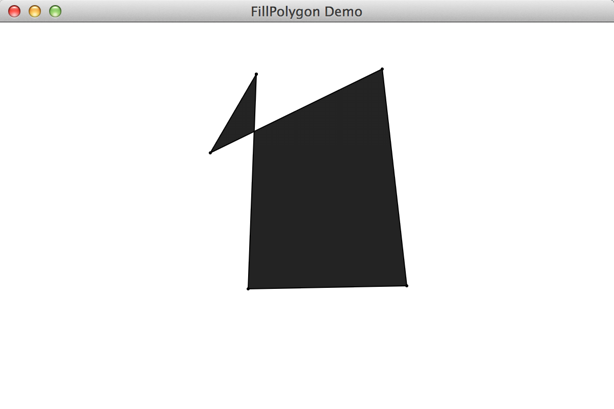

Dec 9, 2014 by whimsycwd

# Overview


计算机图形学期末PJ

1.  多边形区域填充
2.  3D立方体投影展示程序


#  Requirements

JDK1.6

#  How to run

```
1.  git clone https://github.com/whimsycwd/GemetoryPJ.git
2.  mvn clean compile
3.  mvn exec:java -Dexec.mainClass="base.FillPolygon"   # 多边形填充
4.  mvn exec:java -Dexec.mainClass="bonus.Cube"         # 3D立方体投影		
```

#  Hot to Operate

##多边形填充




1.	鼠标点击n个点
2.	最后一个点双击 
3.	这n个点组成的的多边形内部被染色

示例:
<image src="readmeImage/polygon2.png" width="400", height="300">
<image src="readmeImage/polygon3.png" width="400", height="300">


## 3D立方体投影

<image src="readmeImage/cube.png" width="400", height="400">

* `w` and `s` : Pitch

* `a` and `d` : Yaw

* `q` and `e` : Roll


# 实现算法


## 多边形填充

1. 跨立实验判断线段相交

	```
	    public double cross(Point a, Point b, Point c) {
        return (double) (b.x - a.x) * (c.y - a.y) - (double) (b.y - a.y) * (c.x - a.x);
    }
    public int sign(double value) {
        if (value > 1e-8) return 1;
        if (value < -1e-8) return -1;
        return 0;

    }
    public boolean intersection(Point a, Point b, Point c, Point d) {
        if (sign(cross(a,b,c)) * sign(cross(a, b, d)) > 0) return false;
        if (sign(cross(c,d,a)) * sign(cross(c,d,b)) > 0)  return false;
        return true;
    }

	```

2.	针对每个像素, 采用射线法, 奇数个与多边形相交的点则为内部点.
	```
    private void fill() {

        Point sp = new Point(9998, 9999);

        int n = nodes.size();

        for (int i = 0; i < WIDTH; ++i) {
            for (int j = 0; j < HEIGHT; ++j) {
                int intersectionNumber = 0;
                for (int k = 0; k < nodes.size(); ++k) {
                    if (intersection(nodes.get(k), nodes.get((k + 1) % n), new Point(i,j), sp)) {
                        ++intersectionNumber;
                    }
                }

                if (intersectionNumber % 2 == 1) {
                    Graphics g = p.getGraphics();
                    g.drawLine(i, j, i, j);
                }
            }
        }  
	```
	


##   3D立方体投影


1. 	图形旋转参考P371, 右手系旋转的方式


	```
	       // rotate along axis X
        double [][] matrixAlpha = new double[4][4];
        matrixAlpha[0][0] = 1;
        matrixAlpha[1][1] = Math.cos(alpha);
        matrixAlpha[1][2] = Math.sin(alpha);
        matrixAlpha[2][1] = -Math.sin(alpha);
        matrixAlpha[2][2] = Math.cos(alpha);
        matrixAlpha[3][3] = 1;


        // rotate along axis Y;
        double [][] matrixBeta = new double[4][4];
        matrixBeta[0][0] = Math.cos(beta);
        matrixBeta[0][2] = -Math.sin(beta);
        matrixBeta[1][1] = 1;
        matrixBeta[2][0] = Math.sin(beta);
        matrixBeta[2][2] = Math.cos(beta);
        matrixBeta[3][3] = 1;

        double [][] matrixGamma = new double[4][4];
        matrixGamma[0][0] = Math.cos(gamma);
        matrixGamma[0][1] = Math.sin(gamma);
        matrixGamma[1][0] = -Math.sin(gamma);
        matrixGamma[1][1] = Math.cos(gamma);
        matrixGamma[2][2] = 1;
        matrixGamma[3][3] = 1;


        g.setColor(Color.white);
        g.clearRect(p.getX(), p.getY(), p.getWidth(), p.getHeight());


        Point3D [] points2 = new Point3D[8];
        for (int i = 0; i < 8; ++i) {
            double [] row = new double[4];
            row[0] = points[i].getX();
            row[1] = points[i].getY();
            row[2] = points[i].getZ();
            row[3] = 1;

            row = multiply(row, matrixAlpha);
            row = multiply(row, matrixBeta);
            row = multiply(row, matrixGamma);

            points2[i] = new Point3D(row[0], row[1], row[2]);

            drawDot(g, row[0], row[1]);

        }
       ```
        


2.	面染色采用 P497 画家算法, 先对平面的Z重心进行排序, 由远及近进行染色. 

	```
	      // fill in color
        double [] center = new double[6];

        for (int i = 0; i < 6; ++i) {
            center[i] = avg(points2, facet[i]);
        }

        int [] idx = new int[6];
        for (int i = 0; i < 6; ++i) {
            idx[i] = i;
        }

        for (int i = 0; i < 6; ++i) {
            for (int j = i+1; j < 6; ++j) {
                if (center[idx[i]] > center[idx[j]]) {
                    int t = idx[i];
                    idx[i] = idx[j];
                    idx[j] = t;
                }
            }
        }

        for (int i = 0; i < 6; ++i) {
            Polygon polygon = new Polygon();
            for (int j = 0; j < 4; ++j) {
                int nodeId = facet[idx[i]][j];
                polygon.addPoint(transform(points2[nodeId].getX()), transform(points2[nodeId].getY()));
            }

            g.setColor(penColor[idx[i]]);
            g.fillPolygon(polygon);
        }        
       ```


# 遇到的困难

1.   Point3D类属于javafx包, 不是标准包, 最终改为自定义的类
2.   图形渲染闪烁问题, 从AWT转化为Swing, 用其框架自动的Double-Buffering来避免闪烁问题, 其中在画图的时候应传递同一个Graphics 否则会导致画布刷新, 从而展示不出新的东西.


  
# 参考文献
  
  1.  http://docs.oracle.com/javase/tutorial/extra/fullscreen/doublebuf.html
  2.  http://www.cnblogs.com/muding/archive/2013/02/19/3031447.html
  3.  http://www.vineetmanohar.com/2009/11/3-ways-to-run-java-main-from-maven/
  4.  http://mojo.codehaus.org/exec-maven-plugin/
  5.  http://www.ibm.com/developerworks/cn/java/l-java3d/
  